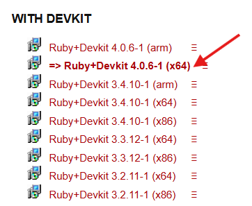

# 💎RUBY Installation



### Go to

[https://rubyinstaller.org/](https://rubyinstaller.org/)



### Click on "Download"





### Click on  `Ruby+Devkit 4.0.6-1 (x64)`

<figure><figcaption></figcaption></figure>



### Check Whether Installed or not


```
ruby -v
```



```
gem -v
```





### SOURCES:

[https://www.youtube.com/watch?v=lOkp4uQBGxQ](https://www.youtube.com/watch?v=lOkp4uQBGxQ)


